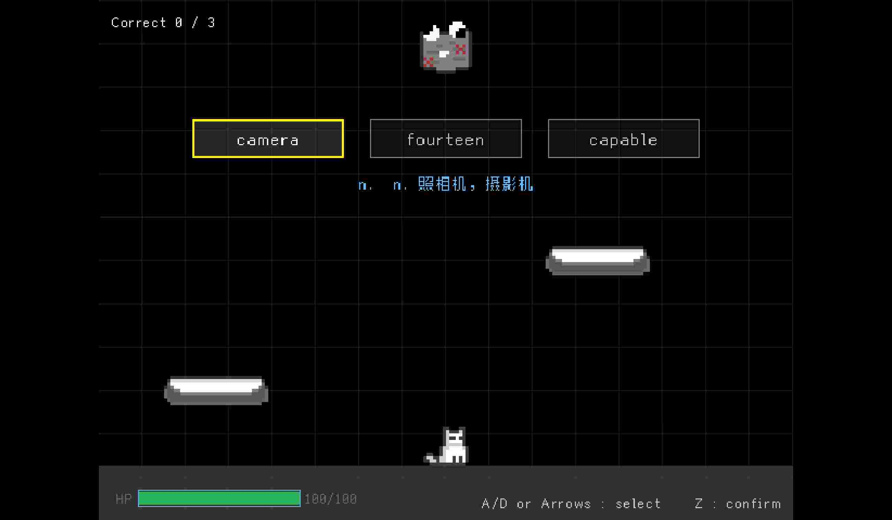

# CatET — Cat's English Trial

> **Cat's English Trial（小猫的英语试炼）** — a 2D platformer that helps you memorize
> English words while playing. Inspired by the CET (College English Test) exams.

CatET is a roguelike word-spelling game built from scratch in **C** with
[**Raylib**](https://github.com/raysan5/raylib) and
[**Raygui**](https://github.com/raysan5/raygui). You explore procedurally generated
levels, spell the right words, dodge enemy bullet patterns, and push through
**100 levels** in a single run — the faster you finish, the better your record.

The game is still in development, but the core loop is fully playable.

 *Player sprite (placeholder banner)*

---

## Feature Highlights

- **Roguelike campaign** — 100 levels with weight-based random level generation
  (platformer ≈ 50%, speed spelling ≈ 30%, maze ≈ 20%); no save/load, every run is a fresh attempt.
- **Real CET word banks** — built-in [`CET4.txt`](assets/words/CET4.txt) and [`CET6.txt`](assets/words/CET6.txt) vocabularies (word + part-of-speech + Chinese meaning).
- **Three difficulty tiers** — Easy / Normal / Hard with distinct word pools and escalating penalties.
- **Four level archetypes** — Classic Platformer, Tower Climb, Speed Spelling, and Maze Puzzle.
- **Turn-based battles** — 3-choice word quiz on your turn, bullet-dodging on the enemy's turn, with **10 bullet patterns**.
- **Boss fights** — a fixed boss level every 20 levels (20/40/60/80/100) mixing spelling with a bullet-hell arena.
- **Built-in speedrun timer** — the best completion time is persisted to [`save.json`](assets/data/.gitkeep) and shown on the start menu.
- **Persistent settings** — sound / music toggles survive restarts.
- **Crisp scaling** — fixed 640×480 logical resolution upscaled through a render target, no blur.
- **Self-contained builds** — all sprites, sounds, fonts and word lists are **embedded into the executable**; installers expose no asset files.



---

## Gameplay

### Getting started

1. From the start menu pick **Play**.
2. Choose a **difficulty**:

| Difficulty | Word pool | Notes |
|---|---|---|
| **Easy** | 100% CET-4 | Baseline |
| **Normal** | ~60% CET-4 + ~40% CET-6 | Mixed pool |
| **Hard** | 100% CET-6 | Max HP +25%, spelling error penalty +50%, bullet damage +100% per tier |

> Each difficulty tier above the previous one raises **max HP +25%**, **spelling-error penalty +50%**, and **bullet damage +100%**.

### Level types

- **Classic Platformer** *(~35%)* — jump across platforms and reach the red flag to clear the level. Touch an enemy to enter a battle scene.
- **Tower Climb** *(~15%, platformer variant)* — climb a procedurally stacked tower of platforms toward the flag at the top.
- **Speed Spelling** *(~30%)* — a 40-second timer; catch falling letters and fill the blank of a partially spelled word using the Chinese/part-of-speech hint.
- **Maze Puzzle** *(~20%)* — a DFS-generated 2D maze (90-second limit); hunt for the correct letters in dead-ends and bring them back to the central spelling area.
- **Boss Fight** *(every 20th level)* — avoid the boss's bullet patterns while spelling words to deplete its HP; a quick spelling grants a critical (25% instead of 20%). Clearing level 100 means **victory**.

### Battle scene

On a platformer level, touching an enemy triggers a **turn-based battle**:

- **Player turn** — three words are shown; pick the one matching the given part-of-speech + Chinese meaning. A wrong pick costs HP.
- **Enemy turn** — the enemy (frozen at the top of the screen) fires a bullet pattern; dodge the bullets. Every bullet hit deals 3–9 random damage (with brief invincibility).
- Win by answering **3 times correctly**; the defeated enemy is removed when you return to the level.

### Progression & records

- HP persists across levels and is restored a little on each clear.
- A hidden global timer starts at level 1 and stops only on failure or completion.
- Only a **successful full clear** records your time; a new best replaces the old one on the start menu.

---

## Controls

| Action | Keys |
|---|---|
| Move left / right | `A` / `D` or `←` / `→` |
| Run (faster move) | hold `Left Shift` while moving |
| Jump (hold to jump higher) | `W`, `↑` or `Space` |
| Menu: move cursor | `W` / `S` or `↑` / `↓` |
| Menu: confirm | `Z` |
| Menu: back | `X` |
| Pause / resume | `Esc` |
| Toggle fullscreen | `F11` or `Alt` + `Enter` |

> The in-game UI is **English only** by design (no localization).

---

## Supported Platforms

- **Windows** — native via MinGW (UCRT64); installable as an **NSIS** setup `.exe`.
- **Linux** — native or cross-built via WSL; packaged as **DEB**, **RPM**, and **TGZ**.
- **macOS** — packaging rules (`.app` Bundle + DMG) are scaffolded in CMake but not yet CI-tested.

---

## Build from source

### Prerequisites

- **CMake ≥ 3.21**
- A C11 compiler: **GCC** (MinGW on Windows, `gcc` on Linux)
- **Python 3** (used by the asset-embedding step)
- **raylib 6.0** — if not found on the system, CMake automatically downloads and builds it via `FetchContent` (requires network access; use a proxy if GitHub is slow)
- *(Optional, for packaging)* **NSIS** on Windows; `dpkg-deb` / `rpmbuild` on Linux

### Windows (MinGW)

```sh
cmake --preset gcc-mingw-release
cmake --build --preset release
```

The executable is produced under `out/build/gcc-mingw-release/`. For a debug build, use the `gcc-mingw` preset / `debug` build preset.

### Linux (native)

```sh
cmake -S . -B out/build/linux-release -DCMAKE_BUILD_TYPE=Release
cmake --build out/build/linux-release -j$(nproc)
```

### One-click packaging — [`build.py`](build.py)

A helper script builds and packages installers into the workspace root:

```sh
python build.py                    # build for the current platform
python build.py --platform windows # only Windows (NSIS .exe)
python build.py --platform linux   # Linux natively or via WSL
python build.py --all              # try both platforms
```

Generated artifacts (named `CatET-<platform>-<arch>-v<version>`):

```
Windows/  CatET-Windows-x64-v0.2.0.exe      (NSIS installer)
Linux/    CatET-linux-x64-v0.2.0.deb|.rpm|.tar.gz
```

### Running from the build directory

During development, assets are copied next to the executable automatically
(see [`CMakeLists.txt`](CMakeLists.txt)), so you can just run the binary directly.

---

## Project structure

```
CET/
├── main.c                  # entry point (calls Run())
├── CMakeLists.txt          # top-level build + CPack packaging
├── CMakePresets.json       # CMake presets (MinGW debug/release)
├── build.py                # one-click cross-platform packaging script
├── assets/
│   ├── sprites/            # player / enemy / boss / bullet / platform / icon sprites
│   ├── sounds/             # sound effects (.ogg, most from Mixkit)
│   ├── words/              # CET4.txt / CET6.txt word banks
│   ├── fonts/              # pixel_font.ttf (fusion-pixel-font, NOT in this repo — see below)
│   └── data/               # save.json (best time + audio settings)
├── cmake/                  # custom CMake modules (Findraylib.cmake)
├── include/                # public headers
│   ├── core/               # framework: window, scene stack, global config
│   ├── entities/           # player, platform, enemy, boss, bullet, flag, maze
│   ├── scenes/             # start, platform, battle, maze, spell, bossfight,
│   │                       # pause, fail, finish, settings, transition, test
│   ├── systems/            # level flow, words loader, save data, speedrun, dialogue
│   └── tools/              # camera, animation, timer, hud, menu, strings, resource…
└── src/                    # implementations (mirrors include/)
```

**Layering:** `core` (framework) ← `tools` → `systems` → `entities` → `scenes`.
Headers use the double guard convention (`#ifndef` + `#pragma once`).

### Resource embedding

[`src/tools/pack_assets.py`](src/tools/pack_assets.py) compiles every file under
`assets/` into C byte arrays (`embedded_assets.c` / `.h`) that are linked into the
executable. At runtime, [`include/tools/resource.h`](include/tools/resource.h)
loads textures, sounds, fonts and word lists straight from memory — the installed
game has **no external asset folder**.

---

## Save data

The game is roguelike by design and has **no save/load**. The only file written is
[`save.json`](assets/data/.gitkeep) (next to the executable), which persists:

```json
{ "bestTime": 123.45, "soundEnabled": true, "musicEnabled": true }
```

- `bestTime` — best full-clear time in seconds (only updated on success).
- `soundEnabled` / `musicEnabled` — audio toggles from the settings overlay.

---

## Tech Stack

| Area | Choice |
|---|---|
| Language | C11 |
| Graphics / audio | [Raylib 6.0](https://github.com/raysan5/raylib) |
| UI (menus) | [Raygui](https://github.com/raysan5/raygui) |
| Build system | CMake ≥ 3.21 + CPack + presets |
| Packaging | NSIS (Windows) / DEB, RPM, TGZ (Linux) |
| Tooling | Python 3 (asset embedding), clangd (`compile_commands.json`) |

---

## License

Distributed under the **GNU General Public License v3.0** — see [`LICENSE`](LICENSE).

---

## Acknowledgements

- **Nai Tang** (my cat) — the inspiration for the game's main character.
- [@raysan5](https://github.com/raysan5) — [Raylib](https://github.com/raysan5/raylib) and [Raygui](https://github.com/raysan5/raygui) are truly fantastic libraries!
- [@TakWolf](https://github.com/TakWolf) — the [pixel-font](https://github.com/TakWolf/fusion-pixel-font) used in-game.
- Deepseek - helped me a lot during the game development.
- [Mixkit](https://mixkit.co/) — most of the sound effects.

---

## Wait! Can I use the assets FREE?

Short answer: **the code is GPL-3.0, but the assets are a mixed bag — always
check the origin of each item before reusing it outside this project.**

Everything under `assets/` is embedded into the executable at build time (see
[Resource embedding](#resource-embedding)), but the files come from different
origins:

| Directory | Contents | Origin / License |
|---|---|---|
| [`assets/sprites/`](assets/sprites/) | Player (`cat_*`), enemy, boss, bullet, platforms and the app icon | Drawn for this game (the cat character is inspired by **Nai Tang**). Use freely within this project; reuse elsewhere at your own discretion. |
| [`assets/sounds/`](assets/sounds/) | 9 `.ogg` sound effects | **Not all self-made.** Most come from [Mixkit](https://mixkit.co/) and are used under its free license (see below); the rest were created or edited by me. |
| [`assets/words/`](assets/words/) | `CET4.txt` / `CET6.txt` word banks | Bundled with the game; format is `word<TAB>part-of-speech. meaning`. |
| [`assets/fonts/`](assets/fonts/) | `pixel_font.ttf` (UI font) | From [fusion-pixel-font](https://github.com/TakWolf/fusion-pixel-font) by [@TakWolf](https://github.com/TakWolf). **Not distributed in this repo** — `assets/fonts/` is git-ignored (see [`.gitignore`](.gitignore:26)). Download it and place it there before building. |
| [`assets/data/`](assets/data/) | `save.json` (runtime) | Runtime-only persistence, not a shipped asset. |

### About the sound effects (important)

The sound effects are **not all produced by me**. A large part of them come from
[Mixkit](https://mixkit.co/) and are licensed under
[Mixkit's Free License](https://mixkit.co/license/), which allows free use in
personal and commercial projects but **restricts reselling or redistributing the
sounds themselves** (for example, bundling them standalone on an asset store). A
few effects were made or edited by myself.

If you plan to reuse the audio outside CatET, please check each file against the
source site's license terms and give proper attribution where required.

### Why is the font missing from the repo?

The UI font is `pixel_font.ttf` from
[fusion-pixel-font](https://github.com/TakWolf/fusion-pixel-font). Because it is
licensed separately and kept out of this repository (see
[`.gitignore`](.gitignore:26)), you need to fetch it yourself before building:

1. Grab `pixel_font.ttf` (or any `.ttf` from the project) from the
   [releases](https://github.com/TakWolf/fusion-pixel-font/releases).
2. Place it at `assets/fonts/pixel_font.ttf`.
3. Build as usual — the font is then embedded along with everything else.

Without it, the game still runs but renders text with Raylib's built-in font.
